# MLSys 科研选题 Pipeline（Agent 操作手册）

**版本**：v1.0 ｜ **日期**：2026-09-13 ｜ **适用**：MLSys / 系统类（推理系统、训练系统、调度、编译）选题
**这份文件的目的**：把本工作区（选题、预登记、实验、审计、结题全流程）**已经用血换来的判据**，交成一个**可被 Agent 直接执行**的选题 pipeline，用来帮你选科研课题、并在立项前把伪问题挡住。

## 0. 文件分工（先读这一段，否则会重复劳动）

| 文件 | 角色 | 谁的事实源 |
|---|---|---|
| **`PIPELINE.md`**（本文件） | **流程控制器**：阶段、动作、Agent 协议、交互契约 | 怎么做 |
| [`pipeline/gates.json`](pipeline/gates.json) | **判据事实源**（机器可读）：每阶段的必填小节、勾选清单、杀出口 | **判据**（唯一） |
| [`pipeline/check.py`](pipeline/check.py) | **校验器**：声称某阶段完成前，机器核一遍；`--list` 打印判据表 | 执行 |
| [`pipeline/new_candidate.py`](pipeline/new_candidate.py) | **脚手架**：建 `candidates/<slug>/` 并生成各阶段骨架（内容直接来自 gates.json） | 执行 |
| [`pipeline/gate.py`](pipeline/gate.py) | **单闸门视图**：`python pipeline/gate.py S3b --dir candidates/<slug>` 打印该闸门的判据/勾选/阻塞 | 执行 |
| [`pipeline/solved_scan.py`](pipeline/solved_scan.py) | **S3b 取证工具**：跨引擎 × 跨社区检索（manual / api / offline 三模式，可复现） | 执行 |
| [`docs/TOPIC_METHODOLOGY.md`](docs/TOPIC_METHODOLOGY.md) | **原理与实证索引**：真痛点四条件、伪问题七形态、自检十问、判定纪律、模板 | 为什么 |
| [`pipeline/CONTEXT_INDEX.md`](pipeline/CONTEXT_INDEX.md) | **本工作区内容地图** + `#6` 的回溯案例（每个阶段当时做对/做错了什么） | 整理 |
| [`EXECUTION_PLAN.md`](EXECUTION_PLAN.md) | **当前主线的执行方案**（已选定的方向怎么跑） | 执行 |

> **改判据只改 `gates.json`**，然后同步本文件的叙述与 `notes/decision_log.md`。文档与机器判据漂移 = 这个 pipeline 失效。

## 1. 三种运行模式（先确认用户要哪一种）

| 模式 | 触发 | 跑哪些阶段 | 典型耗时 |
|---|---|---|---|
| **A. 全新选题** | "帮我选一个课题" | S0 → S5（选完再进 S6） | 1–3 天（0 GPU） |
| **B. 痛点体检** | "我有个想法，值不值得做" | S1 → S3（快速挡伪问题） | 0.5 天 |
| **C. 在跑方向审计** | "这个实验计划有没有问题" | S4 → S7 的**反向审计**（用判据查已做的实验） | 0.5 天 |

**模式 C 是本工作区吃过亏才加的**：`#6` 在 T2 之后才发现"上界只有 +0.1%（S4 没做）""预登记网格漏了极值（S5 没做全）"，两处都是**在花掉 GPU 之后**才暴露。见 `notes/audit-p06-design-2026-09-13.md`。

## 2. S0 之前：Agent 必须先从用户拿到的 6 件事

**不许替用户假设这 6 项**；缺哪项就停下问（一次最多问 3 个）。拿到后写进 `candidates/<slug>/00_intake.md`。

1. **目标会议与截稿日期**（决定"决策级"还是"论文级"）
2. **算力预算**：GPU·小时 + 显存下限 + 卡型约束（驱动/CUDA/引擎版本）
3. **时间预算**：工作日数 + 最晚"必须杀"的日期
4. **可用资产**：引擎与版本、模型族、数据集、已有代码/补丁、能否上真机
5. **技能面**：会不会改 CUDA / 调度器 / 只做测量
6. **本轮明确不做**什么（防范围蔓延）

## 3. 流程图

```mermaid
flowchart TD
    Q["用户：我想做一个 MLSys 课题"] --> S0["S0 立项准备<br/>约束量化<br/>成本 0 GPU·h"]
    S0 -->|"算力=0 且不降级"| KILL0["停止"]
    S0 --> S1["S1 痛点发现<br/>只收真痛点，禁止提方案<br/>≤1 GPU·h"]
    S1 -->|"全部 < L1（没数字）"| BACK1["回到搜证"]
    S1 --> S2["S2 伪问题筛查<br/>七形态 + 十问"]
    S2 -->|"存活 0 条"| BACK1
    S2 --> S3["S3 占位与先行核查<br/>必须读正文 + 找齐已 ship 旋钮"]
    S3 -->|"只有『没人做过』"| KILL3["杀"]
    S3 --> S3b["S3b 已解决性核查<br/>跨引擎 × 跨社区<br/>0 GPU·h"]
    S3b -->|"别的引擎/社区已 ship 同等解法"| KILL3B["杀"]
    S3b --> S4["S4 可测量性与上界<br/>恒等式 + 仪器冒烟 + oracle 上界"]
    S4 -->|"oracle 上界 < 8%"| KILL4["杀（省钱的关键闸门）"]
    S4 --> S5["S5 预登记<br/>判据/网格/噪声/杀条件"]
    S5 -->|"网格缺极值"| BACK5["补网格"]
    S5 --> S6["S6 三级判定 T0→T1→T2<br/>每级独立 kill"]
    S6 -->|"T2 < 8%"| KILL6["杀或按扩展条款补测"]
    S6 --> S7["S7 归因与机制<br/>分解 + 排除替代解释"]
    S7 -->|"无法归因"| DEMOTE["降级为现象记录"]
    S7 --> S8["S8 结题与归档<br/>适用范围 + 反证 + 产物"]
    S8 --> PUSH["入库 + 推 GitHub"]
    KILL4 -.-> MEAS["降级路线：测量/复现性论文<br/>（必须新开独立预登记）"]
    KILL6 -.-> MEAS
```



## 4. 阶段动作（判据见 `pipeline/check.py --list`，此处只写"怎么做"）

### S0 立项准备
把"想做什么"翻译成"在什么约束下做什么"。**约束不量化就不许往下走**。
- 动作：按 §2 的 6 项建 `00_intake.md`；算力写成 `GPU·小时 / 显存下限 / 卡型`。
- 常见错误：写"用 A100 就行"（没有显存下限与卡数），或没写"最晚何时杀"（导致沉没成本绑架判断）。

### S1 痛点发现（**禁止提方案**）
- 动作：从 5 类来源收集痛点——① 生产事故报告/工程博客里的实测数字；② 引擎 issue tracker 里带复现步骤与数字的报告；③ 已发表测量论文的"未解释现象"；④ 部署成本异常（显存、尾延迟、利用率）；⑤ 你自己跑出来的反常数字。
- 每条痛点写五字段：**现象 / 谁在疼 / 量级 L0–L3 / 证据（可复现命令或链接）/ 反证**。
- **至少 2 条必须来自"别人"**（你自己的直觉不算证据）。
- 量级分级（详见 `docs/TOPIC_METHODOLOGY.md` §1.4）：L0 只有说法；L1 有数字；L2 有数字 + 可复现；L3 有数字 + 可复现 + 别人也疼。

### S2 伪问题筛查
- 动作：对每条痛点跑**伪问题七形态**与**自检十问**（`docs/TOPIC_METHODOLOGY.md` §1.2/§1.3），命中就标出命中理由。
- 输出"存活清单"与"淘汰台账"——**淘汰项必须写明理由**，负面结论同样是资产。
- 七形态里最常命中的两条：**"某方法没人用过"**（不是理由）与**"指标能动"**（能动 ≠ 有人疼）。

### S3 占位与先行核查（**必须读正文**）
- 动作：每个存活痛点找 ≥3 个最近邻并**读正文**（记录页/节号）；**找齐目标引擎里已 ship 的旋钮**并把它写成最强基线；写"审稿人会问的那一问"的**结构性**回答；先想好"若被占，降级成什么"。
- 判死线：立项理由只有"没人做过" ⇒ 杀；给不出结构性理由 ⇒ 改写定位或杀。
- **本仓库实证**：`#6` 在这一步只查到"引擎内深度轴空白"就继续了，但没有预判"γ 轴已被 `num_speculative_tokens_per_batch_size` 占住且 RFC 还在推进"对增量上限的含义（decision #62）。

### S3b 已解决性核查（**跨引擎 × 跨社区**，v1.1 新增）

- **要回答的唯一问题**：**这个痛点，别的引擎/别的社区是不是早就解决了？**
- 动作：⓪ **先查 [`notes/OCCUPANCY_LEDGER.md`](notes/OCCUPANCY_LEDGER.md)**（已知被占图：27 类问题类 + 墓碑 GPU·h）——本工作区实证：第 2 轮**重复发现了 4 天前已判死的深度轴**，根因就是没先查库存；① 用**问题类**描述候选（不是某个引擎的功能名）；② 跑 `python pipeline/solved_scan.py --keywords … --repos …` 生成待查清单；
  ③ **逐条打开链接读正文**，填判定矩阵（≥5 行，覆盖 ≥3 个引擎/实现与 ≥2 个研究社区，每行带 URL + 查证深度）；
  ④ 写一条**反证**（主动找"已被解决"的证据）；⑤ 写明降级路径。
- 判死线：任一引擎/社区**已 ship 或已发表**同一问题类的同等解法，且差异轴讲不出**条件性**区别 ⇒ **杀**；
  矩阵不足 5 行或缺 URL/查证深度 ⇒ **禁止进入 S4（不许开 GPU）**。
- **本仓库实证（v1.1 的由来）**：2026-09-13 的 `sglang-draft-corpus` 走到了 T2 阶段（热路径 recovery 86–93%），
  才被发现**同一问题类在 vLLM 0.29 里是默认特性**（prompt-lookup decoding，`vllm/config/speculative.py:452-455`、
  `vllm/v1/spec_decode/ngram_proposer.py`）；原因就是 S3 只查了 SGLang 一家。**0 GPU 本可拦下，却花了 ≈1.15 GPU·h 与数小时。**

### S4 可测量性与上界（**最省钱的闸门**）
- 动作：① 把观测量写成**恒等式**（例：`Δln(吞吐) = Δln(接受长度) − Δln(每步代价)`）；② 仪器冒烟（含 gauge vs 计数器、单位、口径）；③ 算 **oracle 上界**——完美决策能赚多少百分比；④ **采数前**估计噪声并写进判据；⑤ 列出环境前提；⑥ 写出结论的**可采纳前置条件**。
- 判死线：**oracle 上界 < 8% ⇒ 杀**。
- **本仓库实证（这一条救了后面的钱）**：`#6` 的 T2 oracle 上界实测只有 **+0.1%**，且当时只在 `bs=1` 子空间算得（decision #53）——如果 S4 早就做了，这个方向会在一开始就被拦下。

### S5 预登记
- 动作：写主假设 / 观测量 / 判据 / 网格 / 杀判据 / 噪声与可分辨性 / 扩展条款 / 修订记录；把文件提升为 `notes/prereg/<slug>.md`（仓库级冻结副本，效力来自**时点**）。
- 硬要求：**网格覆盖每个轴的极值** + 逐轴论证"翻转会不会发生在极值处"；每个判据带"效应 > k×噪声"的可分辨性要求；基线含引擎已 ship 的控制器。
- **本仓库实证**：`#6` 预登记 γ 网格是 `{1,3,5,7}`，实际只跑了 `{3,7}`，而缺的正好是唯一可能反转的角落（decision #68）。**预登记与实际执行的差异必须逐项对账**。

### S6 三级判定（T0 → T1 → T2）
- T0 只验"旋钮可操作"（半天，不动就杀）；T1 看信号（**必须同时报效应量 + 噪声 + 可分辨性**）；T2 做增量对照（相对**最佳固定配置**与**已 ship 控制器**两个基线，两个 8% 不是同一个比较）。
- 对照条件在同一实验内必须完全一致（串行化/数据集/KV dtype/并发上限/暖机重复数）；逐次原始数据留在**仓库外**。
- **本仓库实证**：`+0.1%` 的 T2 只在 `bs=1` 算得、噪声 ±10.6% 把 5.1% 的差异淹掉、冷启动让"全部重复均值"系统性低估赢家（decision #55/#65/#66）。

### S7 归因与机制
- 动作：把效应**分解**为可命名因子并给出占比；逐个排除显存挤占 / 排队 / 顺序 / 冷启动 / 跨机器差异（排除证据用**计数器**，不用 gauge）；写清适用范围；复核 S4 的上界。
- 判死线：无法归因 ⇒ 降级为现象记录，**禁止**写成机制主张。
- **本仓库实证**：`#6` 的 S7 做得很干净（16/16 格 `preemption=0`，逐位置接受率显示"1 层 drafter 从第 2 个位置起接受率为 0"），于是得到一个**结构性否证**而不是"没测出来"（decision #67）——这是负面结论能达到的最好形态。

### S8 结题与归档
- 动作：结论 + 适用范围 + 反证 + 产物清单 + 决策日志行 + 后续动作；勾完 `docs/TOPIC_METHODOLOGY.md` §5.5 的 12 项审计清单。
- **负面结论必须入库**；被取代的旧结论就地标注；若机制死但测量有价值 ⇒ **新开独立预登记**，不得重解读旧数据。

## 5. Agent 操作协议（12 条硬规则）

1. **一次只推进一个阶段**；每阶段结束写产物 + 在 `notes/decision_log.md` 加一行（决定 / 依据 / 影响文件）。
2. **先量化，再讨论**。任何"更好/更快/更重要"都必须带数字或明确标 `未取证（L0）`。
3. **禁止无证据断言**：不许把"可能""业界普遍认为"写成依据。
4. **不越过 S4 采数据**：没算 oracle 上界、没核仪器口径，不许开 GPU。
5. **给概率，不给态度**：判断写成"P(成立) ≈ X%"，并写依据；后续数据推翻时要显式更正（本工作区有多次自我更正的先例）。
6. **结论必须带适用范围**：哪些轴、族、上下文、并发区间没测。
7. **区分"现象层"与"机制层"**：现象能复现不等于机制成立；机制主张必须过 S7。
8. **术语纪律**：内部叫法要标注"内部标签、非既有术语"（`#6` 的 "Speculative Compute Allocation" 就是内部叫法）。
9. **环境前提先于实验设计**：驱动/CUDA/引擎版本/dtype 不满足就直接判死整条路线，不要"先跑起来再说"。
10. **产物治理**：原始数据在仓库外 + 入库派生表与结论；用 `git ls-files` 验证真的入库了（本工作区被 `.gitignore` 静默吞过）。
11. **预登记纪律**：判据写在采数之前；事后调整必须标注时点；**连自己写错的判据也要照实登记**。
12. **每阶段结束推送 GitHub**（用户要求：改动即推远端）。

## 6. 与用户的交互契约

**必须停下来问用户的时刻**（一次 ≤3 问）：
- S0 的 6 项约束缺失任何一项；
- S2 存活清单只剩 1 条且置信度低（要给用户"换方向"还是"继续窄化"的选择）；
- S4 的 oracle 上界落在 8% 附近（±3% 内）——此时"杀/续"是投资决策，不是技术判断；
- S6 出现"判据与预登记不一致"；
- 任何时候需要花 >8 GPU·h。

**呈现结论的固定格式**：
```
结论：<一句话>
依据：<数字 + 出处（decision #/文件）>
反证：<已知的反面证据或未测区间>
概率：P(成立) ≈ X%
下一步：<具体动作 + 成本>
```

## 7. 快速通道与降级

| 场景 | 走法 |
|---|---|
| 零算力 | S0 → S1 → S2 → S3（全部 0 GPU·h），产出"痛点清单 + 占位报告"；或转测量/复现性论文准备 |
| 已有想法只想挡伪问题 | 模式 B：S1 → S2 → S3 |
| 审计在跑的方向 | 模式 C：用 S4/S5/S7 的判据反向查实验计划 |
| 机制死但测量有价值 | **新开独立预登记**的测量论文，不得重解读旧数据（D1 条款第 3 条） |
| 复现性研究 | 直接进 S5，把"复现谁、在什么机器上、差多少算失败"写成判据 |

## 8. 常见失败模式（全部来自本工作区实证）

| 反模式 | 后果 | 出处 |
|---|---|---|
| 用"没人做过"立项 | 做到一半发现引擎已 ship 同类旋钮 | decision #62 |
| 没算 oracle 上界就开跑 | 跑完发现上界只有 +0.1% | decision #53 |
| 预登记网格与实际执行不对账 | 缺的正好是唯一可能反转的角落 | decision #68 |
| 用"全部重复均值"报数 | 冷启动让赢家被系统性低估 | decision #65/#66 |
| 用启发式代替显著性检验 | "差距 > 2×极差" 在 3–5 次重复下不可靠 | decision #66 |
| 指标口径没对着源码核 | 定义错的指标造出 5.39 的假 headroom | decision #51 |
| 只看一个指标字段 | 机制数据在库里躺了两轮没人看 | decision #67 |
| 跨机器复现不了却当成机制 | 4× 差异被当成"运行点相关" | decision #64 |
| 结果目录放在仓库内 | 同步/清理把原始数据删掉 | decision #47/#50 |
| 显存挤占伪装成机制 | 需要 `preemption==0` 这类前置条件才能采信 | decision #51/#68 |
| **先做量级量化、后查占位** | 花一天量化了一个 4 天前已被 RFC 占住的方向（`hybrid-state-serving`，decision #73） | 规则：**S1 每条痛点落地时必须同时做一次占位快扫**，不要等到量化之后 |
| **远程命令里用 `pkill -f <字面量>`** | **自杀**：命令行自己含该字面量 ⇒ 杀掉自己的 SSH 会话（本工作区已踩 3 次） | 一律用不自匹配的写法，如 `pkill -f "vllm[ ]serve"` |

## 9. 命令速查

```bash
python pipeline/check.py --list                        # 打印判据表（gates.json 的渲染）
python pipeline/new_candidate.py --slug <slug> --title "<标题>"   # 建档案 + 生成骨架
python pipeline/check.py --dir candidates/<slug> --through S4     # 声称 S0–S4 完成，逐条核
python pipeline/check.py --dir candidates/<slug> --repo .         # 另核 prereg 提升与决策日志
python pipeline/gate.py S3b --dir candidates/<slug>    # 单闸门判据 + 勾选状态 + 阻塞
python pipeline/solved_scan.py --keywords "…" --repos …  # S3b 取证（跨引擎×跨社区）
python pipeline/check.py --selftest                    # 校验器自测
python pipeline/new_candidate.py --selftest            # 脚手架自测
```

## 10. 变更记录

| 版本 | 日期 | 变更 |
|---|---|---|
| v1.1 | 2026-09-13 | **新增 S3b「已解决性核查」**（跨引擎 × 跨社区，0 GPU·h，位于 S3 与 S4 之间）：来自 `sglang-draft-corpus` 的实证——S3 只查单一引擎，漏掉 vLLM 默认 ship 的同类机制。同时新增 `pipeline/gate.py`（单闸门视图）与 `pipeline/solved_scan.py`（取证工具）；`lib.stage_index` 支持 `S3b` 这类中间闸门 |
| v1.0 | 2026-09-13 | 首版：把本工作区的选题判据固化为 9 阶段 pipeline（S0–S8），配 `gates.json` 机器判据 + 校验器 + 脚手架；新增 S4「oracle 上界闸门」与 S5「网格覆盖极值」两条硬要求（`#6` 的两次实际教训）；模式 C（在跑方向审计）来自 `notes/audit-p06-design-2026-09-13.md` 的方法 |
