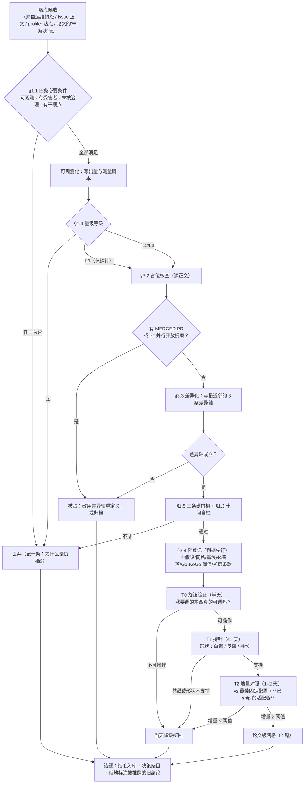

# 选题方法论（可复用）—— 从"真痛点"到"结题/归档"

**版本**：v1.1 ｜ **日期**：2026-09-13 ｜ **适用**：任何"要在系统方向里选一个课题"的场景（读者默认是未来的我）
**来源**：本工作区（MLSys 选题）2026-09-11～09-13 的全部复盘：14 项归档 + 7 项存活/暂缓 + 一轮完整的三级判定（T0→T1→T2）+ 一次换机重建 + 一次外部复核 + **一次实验设计审计（含一次结构性否证）**。
**每一节末尾的"实证"都指向本仓库的 decision 编号或结果文件，规则可追溯、可反驳。**
**本文件是"为什么"；流程控制与机器判据在 [`../PIPELINE.md`](../PIPELINE.md) 与 [`../pipeline/gates.json`](../pipeline/gates.json)。**

> ## 第一原则
> **先证明"疼"，再证明"没人治"，最后才谈"我怎么治"。**
> "某个方法还没人用过"**不是**立项理由——那是"方法找问题"，是伪问题的第一高发区。

---

## 姊妹文档（2026-09-15 补）

| 文档 | 是什么 | 何时读 |
|---|---|---|
| [`PRACTICE_TO_TOPIC_METHODOLOGY.md`](PRACTICE_TO_TOPIC_METHODOLOGY.md) | **纯方法论**（10 节 + 循环清单）：原料来自实践现场，**检索只承担证伪职能** | 每轮开新候选前 |
| [`PRACTICE_TO_TOPIC_CASESTUDY_2026-09-15.md`](PRACTICE_TO_TOPIC_CASESTUDY_2026-09-15.md) | **实证附录**：4 个候选、0 存活；逐条记录方法论哪些判据真的能杀，**以及它拦不住的 4 件事**（含 4 条修订建议） | 判决为 KILL 之后；或连续多个候选死于同一约束时 |
| **本文** | 流程与判据的**权威事实源**（含决策编号与结果文件索引） | 立项 / 判定 / 结题时 |

**为什么要有姊妹文档**：本文是"怎么走"，`PRACTICE_TO_TOPIC_METHODOLOGY.md` 是"为什么这样走"，案例研究是"走完一次到底发生了什么"——**包括 4 个候选全杀、以及我自己犯的 5 个口径错误**。三份合起来才构成可复核的闭环。

---

## 0. 怎么用（三档）

| 时间 | 只读这些 |
|---|---|
| **30 秒** | §1.1 四条必要条件、§1.3 伪问题自检十问 |
| **1 小时** | §2 流程图走一遍 + §3 各步操作 + §5 模板留痕 |
| **新项目启用** | §0.1 脚手架 + 把 §5 的模板复制进去 |
| **真的要开始选** | 走 [`../PIPELINE.md`](../PIPELINE.md) 的 S0–S8：`python pipeline/new_candidate.py --slug <短名>` 建档案，`python pipeline/check.py --dir candidates/<短名> --through S<n>` 逐阶段核 |

### 0.1 新项目脚手架（最小可用集）

```
<repo>/
├── PIPELINE.md               # 选题 pipeline（Agent 操作手册：阶段/协议/交互契约）
├── pipeline/                 # gates.json（判据事实源）+ check.py + new_candidate.py + CONTEXT_INDEX.md
├── candidates/<slug>/        # 候选方向档案（S0–S5 产物；骨架由脚手架生成）
├── README.md                 # 当前阶段一句话 + 存活清单
├── EXECUTION_PLAN.md         # 唯一权威执行依据（门槛/清单/判据/决策记录/变更记录）
├── docs/
│   ├── TOPIC_METHODOLOGY.md  # 本文档（复制一份进来）
│   ├── GLOSSARY.md           # 命名表（#N / probes/pNN-* / aux-cN-* 之类）
│   ├── evidence/             # 承重结论的证据副本（"某方向空缺/已死"必须回到这里核对）
│   └── reviews/              # 独立评审（YYYY-MM-DD-verdict-NN-<slug>.md）
├── notes/
│   ├── decision_log.md       # 决策台账（每条：决定 / 依据 / 影响文件）
│   └── prereg/               # 预登记（判据先行；修订要标"数据采集前/后"）
└── results/<probe>/<date>/   # 产物（结论入库；逐次原始数据也要留档）
```

三条硬规矩：**① 只有一份权威执行文件**（其余都是论证材料，且要标"不可靠之处"）；**② 生死都记一条**；**③ 被推翻的结论就地标注**（不许静默改写历史）。

---

## 1. 第一原则：只做真痛点（伪问题筛查）

### 1.1 真痛点的四个必要条件（缺一不可）

| # | 条件 | 判据 | 取证方式 |
|---|---|---|---|
| 1 | **可观测** | 有一个能在真实系统上测到的量（吞吐/延迟/显存/成本/占用率） | 能写出测量脚本与判据；量级来自实测或引擎常量 |
| 2 | **有受害者** | 能指出**哪类负载/哪种部署形态**为它付出代价 | 给出该负载在真实世界的占比证据（论文/生产报告/自身 trace），不是"可能存在" |
| 3 | **未被治理** | 现有机制**结构上**治不了，而不是"没人想到" | 指出引擎/框架里**具体哪个代码路径**做不到，并说明为什么（缺信息？缺接口？语义冲突？） |
| 4 | **有干预点** | 存在可实施的干预（改配置/改调度/改数据结构），且**代价已知** | 干预点的位置 + 代价（多占多少显存/多几次拷贝/改多少行） |

> **反过来说**：任何一条拿不出证据，就先当伪问题处理，不要进入预登记。

### 1.2 伪问题的七种形态（每一种都有本工作区的实证）

| 形态 | 症状 | 识别方法 | 本工作区实例 |
|---|---|---|---|
| **① 算术量级型** | 量级来自"理论上能省 X%"，零实测 | 问"谁在真机上量过？" | `#5`（O8 估计、零实测）⇒ 归档 |
| **② 已被 shipped 覆盖型** | 以为没人做，其实引擎已默认实现 | 读**发货默认值**与代码路径，不只读文档 | `#4`（ROCm ATOM 已实装 ladder+需求驱动 rung+LRU+成本记账；vLLM `#50172` 在办）⇒ 暂缓 |
| **③ 基线反证型** | 现象存在，但**基线已把它消掉** | 跑两个朴素基线，看差异是否为零 | `#2`（`TTL-300s` 与 `LRU-leaf` **逐字节相同**）⇒ 归档（理由改写为"基线反证"） |
| **④ 度量口径型** | 指标定义错了，量出来的是**结构性假象** | **对着源码核返回值语义**再定义口径 | D3：`R_reserve = 新增块×block_size/ctx`，而 `allocate_slots` 返回的是**新增块** ⇒ 比值恒为 `block_size/γ`、必然 > 2（差点据此立项） |
| **⑤ 不可行域型** | 只在拿不到的资源上成立 | 先算资源账（显存/卡数/时间），再谈机制 | `#13`（需 8×H200）⇒ 归档；本轮 `128k 上下文`在 32 GB 卡上同理不可行 |
| **⑥ 被更一般机制吸收型** | 你的特例已被某个更一般的方法覆盖 | 找"更一般"的那篇/那个实现 | `#18`（D-cut 已做 cross-request 预算重分配）⇒ 归档 |
| **⑦ 方法找问题型** | 从一个想用的技术出发，反推一个"问题" | 问"如果这个技术不存在，这个问题还值得做吗？" | 高危区；立项动机必须写成"痛点 → 方案"，不许反过来 |

### 1.3 伪问题自检十问（勾选表，任一为否就不要立项）

- [ ] 1. 我能用一句话说出**谁**在**什么负载**上**损失了什么**？
- [ ] 2. 这个损失有**真机数字**（或引擎常量推导），不是"理论上"？
- [ ] 3. 我读过**现有机制的实现**（不是文档），并指出它**结构上**做不到？
- [ ] 4. 我跑过**至少两个朴素基线**，确认它们消不掉这个损失？
- [ ] 5. 我的量级**不是**由一个我说不清口径的指标算出来的？
- [ ] 6. 所需资源（卡数/显存/时间）**我确实拿得到**？
- [ ] 7. 我能指出**最近邻的 3 篇工作**，并逐条说明差异轴？
- [ ] 8. 我的动机写成"痛点→方案"，**不是**"方案→痛点"？
- [ ] 9. 如果实验结果是**阴性**，这个阴性本身有信息量吗（能否写进论文）？
- [ ] 10. 我能给出**≤2 周内可测**的判据与 kill 条件？

### 1.4 量级取证等级（L0–L3）与准入规则

| 等级 | 含义 | 能否作为主线入场 |
|---|---|---|
| **L0** | 纯算术推算 / 读图投影 / 转述他人未核实的数字 | ❌ 禁止 |
| **L1** | 引擎常量或代码路径证明（"这个表只按 bs 索引，没有 depth 维度"） | ⚠️ 仅探针可入场，须带预登记判据 + ≤2 周换 L2 的路径 |
| **L2** | 单点真机实测 | ✅ 可入场 |
| **L3** | 多点实测 + 与基线对照（含已 ship 的适配器） | ✅ 主线要求 |

> 实证：`#12` 的 `3.28×` 出自**读图投影**（IF 为构造轴）⇒ 只能当 L0；`#3` 的"引擎增量 2–3%"仅适用于工具投机方向。

### 1.5 三条硬门槛（准入判据，逐条可打勾）

- [ ] **① 机制格未被占**：没有 **MERGED PR**，且同一决策上**没有 ≥2 个并行开放提案**。
- [ ] **② ≤2 卡 / ≤2 周**能拿到**可信数字**（不是"能跑起来"，是"能出判据要求的数字"）。
- [ ] **③ 量级来自实测或引擎常量**（§1.4 的 L2+；探针按 L1 规则例外）。
- 附加：**必须写出"与最近邻的差异轴"**，并预登记**判死条件**（否则不立项）。

---

## 2. 流程（审核流程图）

> ⚠️ **本节是草案**：按上一轮讨论与本仓库既有纪律整理。若你有自己的流程图文件（图片/PDF/drawio），发我，我把它作为权威版本合并进来。



**每一步的通过条件与失败去向**

| 步 | 通过条件 | 失败去向 |
|---|---|---|
| 四条必要条件 | §1.1 全满足 | 丢弃（并记"伪问题形态"） |
| 量级等级 | 主线 L2+；探针 L1 带判据 | L0 直接丢弃 |
| 占位核查 | 无 MERGED PR 且 <2 并行提案 | 重定义差异轴，或归档 |
| 差异化 | 3 条差异轴都站得住 | 归档 |
| 预登记 | 判据/阈值/扩展条款写全，且**早于数据** | 返工 |
| T0 | 旋钮可操作（接受率/耗时随旋钮变动，且无损） | **当天**降级 |
| T1 | 形状支持主假设（含"反转存在"） | 归档 |
| T2 | 相对**最佳固定**与**已 ship** 的增量 ≥ 阈值 | 归档 |
| 结题 | 结论入库 + 决策条目 + 旧结论标注 | 不许静默结束 |

---

## 3. 各步骤操作细节

### 3.1 找痛点：来源清单与反模式

**好的来源**（按信噪比排序）
1. **真实部署的运维抱怨**（"我们不得不把 X 调成 Y 才能跑"）——痛点自带受害者与代价
2. **引擎 issue / PR 的正文讨论**（不是标题）：维护者说"这个结构上做不到"的地方
3. **profiler 上的异常热点**：占比与理论不符的项（例：权重流量 58% > KV 32.7%，推翻了一个"KV 预取"方向的动机）
4. **论文里"我们没解决/留给未来"的段落** + **baseline 的缺失**（某类配置从未被对比过）

**反模式**（立即警惕）
- 从一个想用的技术反推问题（§1.2 ⑦）
- 从"某方向没人做过"出发（"没人做"常常等于"不值得做"）
- 从单篇论文的 future work 出发而不验证其动机

### 3.2 占位核查（**必须读正文**）

查四件事：① 目标仓库有没有 **MERGED PR**；② 同一决策上是否有 **≥2 个并行开放提案**；③ **发货默认值**是什么（很多"未治理"其实是默认开关）；④ 相邻方向是否已把它当子问题解决。

**铁律**：
- **只看摘要会误判**——本工作区 `kimi_plan.md` 的三条"引用不实"裁定（SpecTool / AngelSpec / LibraSpec）**全部是误判**，就是只读摘要导致的。
- **issue/PR 必须带 repo 前缀**；引用默认值必须给**代码位置**（文件:行）。
- 结论要落一份 `docs/evidence/*.md` 副本，并注明"原始出处 + 冻结日期"。

### 3.3 差异化检查（与最近邻的三条差异轴）

模板：`notes/<方向>-differentiation.md`，逐条写
1. **对象轴**：改的是谁（独立 drafter 网络深度 / 调度器级跨请求预算 / KV 表示 …）
2. **粒度轴**：在哪个层级做决策（单请求 / 跨请求 / 跨实例）
3. **预算轴**：与什么耦合（与 verify 预算耦合 / 与流水线并行度耦合 …）

每条轴都要写出"最近邻做了 X，我们做 Y，因此**在什么条件下**结论不同"。**写不出来 ⇒ 归档。**

### 3.4 预登记（判据先行）

必含 8 项（缺一不可）：

| # | 项 | 说明 |
|---|---|---|
| 1 | **主假设** | 可被证伪的一句话（例："drafter 容量 ⟂ draft 长度"） |
| 2 | **网格** | 每个轴都要给范围与理由；**并写明极值处的风险**（见 §4.2 覆盖审计） |
| 3 | **基线** | 至少包含：spec off、**最佳固定配置**、**已 ship 的适配器** |
| 4 | **必答项** | 审稿人会问的刁难问题（"为什么引擎自带的表扩不到这个轴？"） |
| 5 | **Go / No-Go 阈值** | 数字写死（例："相对最佳固定的增量 < 8% ⇒ 杀"） |
| 6 | **扩展条款** | 什么条件下自动扩网格/扩家族（**先写，后触发**） |
| 7 | **杀判据** | 出现什么就停（不是"再看数据"） |
| 8 | **修订记录** | 每次改动标**数据采集前 / 后**；事后改动必须写"原判据 / 新判据 / 理由" |

硬件条件分支（如"24 GB 卡则 ctx 收窄"）也属预登记，**必须在采数据前登记**。

### 3.5 三级判定路径（T0 → T1 → T2）

| 级 | 问题 | 成本 | 典型 kill 判据 |
|---|---|---|---|
| **T0** | **我要调的那个旋钮，真的可调吗？** | 半天 / 1 卡 | 旋钮不可操作（改动无效、或结果损坏）⇒ **当天降级** |
| **T1** | 形状是什么：单调 / 反转 / 共线？ | ≤1 天 | 与主假设相反的形状 ⇒ 归档（注意：**截断/代理实现给的是下界**，测不出东西≠证伪） |
| **T2** | 相对**最佳固定配置**与**已 ship 的适配器**，增量够不够？ | 1–2 天 | 增量 < 阈值 ⇒ 归档 |

**三条配套纪律**
- **T0 先做**：不要拿 18 格网格去验证一个可能不存在的旋钮。
- **T1 的结果是不对称的**：用截断/代理得到的往往是**下界**；"测不出任何东西"提示性但非决定性 ⇒ 须补一个**已发布的、真实存在该属性的对照**（如已发布的浅层 checkpoint）再判。
- **T2 必须是策略级比较**：如果退化成"在实测表上算 oracle 上界"，要明确写出**该上界只在被测网格内有效**（见 §4.4）。

### 3.6 结题与归档

- **生与死都要记一条**（归档也要写理由，且理由要可核）。
- **被推翻的结论就地标注**，不许静默改写（例：`#38` 的结论被 `#39` 推翻、变更记录 v1.21 的判断被 #53 降级，都在原地加标注）。
- 结题产出三件套：**结果 summary**（含判据逐条对照）+ **决策条目** + **旧结论标注**。

---

## 4. 判定纪律（九条，全部来自实证）

> 4.1–4.7 来自 2026-09-11～12 的三级判定与审计；**4.8–4.9 来自 2026-09-13 的实验设计审计**（`notes/audit-p06-design-2026-09-13.md`，decision #66–#68）。

### 4.1 先估噪声，再谈差异

**规则**：任何"效应"的判定前，先做**同配置重复 ≥5 次**，报 **p50/p95 与极差**；差异小于 **2×噪声**的不得称效应。

**实证**：T1 的重复间噪声实测 **±10.6%**（同格 3 次：87.81/89.74/97.56 tok/s），而两个 ridge 判定差异只有 **5.1% / 2.8%** ⇒ 半个结论其实是噪声。修正后（固定 shuffle + 更多 prompt）同格极差降到 **3.5%**。

### 4.2 覆盖审计：每个轴的极值都要问"翻转会不会发生在那"

**规则**：网格定稿前，逐轴填这张表——**轴 / 范围 / 极值处未测的风险 / 若翻转需要什么资源**。

**实证**：本工作区原网格只测 `bs=1`（而 prereg 自己写着"反转位置不确定时须扩到 `bs{1,8,32}` 再判"）与 `ctx≤32k`（而**方向动机所在的 185k 重扫区间没测**）⇒ 结论被降级为"条件性阴性"。**动机落在哪，就必须测到哪。**

### 4.3 混淆控制清单（同一实验内必须一致）

- ✅ prompt 集与**顺序**固定（`--disable-shuffle`；否则 + prefix caching ⇒ rep 间不可比）
- ✅ KV dtype 必须与**模型 dtype 一致**（bf16 模型给 fp16 KV ⇒ FlashAttention 直接报 `query and key must have the same dtype`）
- ✅ 编译模式全网格一致（`-enforce-eager` 与 compile 不可混用；混用会产生 ~13% 的系统差）
- ✅ 采样参数（温度/最大长度）一致；`ignore_eos` 之类要么全开要么全关
- ✅ 引擎版本 pin 死，并记进每条结果

### 4.4 上界的有效范围

**规则**：当用"oracle 上界"代替真实策略实现时，必须写明：**上界只在被测网格内有效**——网格漏掉的区域，上界也漏掉。上界赢不了 ⇒ 可以否证"存在更优策略"；上界赢了 ⇒ 只是"值得实现策略"，不是"策略已成立"。

### 4.5 仪器口径必须对着源码核

**规则**：定义任何指标前，读被调函数的**返回值语义**与文档串；指标上线前做一次"**已知答案的对照**"（解析值 vs 实测）。

**实证**：`allocate_slots` 返回的是 **"A list of new allocated blocks"**（新增块），而我们按"总持有块"理解 ⇒ D3 的比值恒为 `block_size/γ`、必然 > 2，**结构性假信号**。修正后（记录总持有块）实测 1.0053 ⇒ 无线可做。

### 4.6 环境前提先于实验设计

**规则**：动实验之前先把环境验完（一张清单，跑一次 10 分钟）：

- 驱动/CUDA 版本**必须满足目标框架下限**（例：vLLM ≥0.28 是 CUDA 13 构建 ⇒ 驱动 ≥580）
- 容器 locale 必须可用（否则 `import readline` 段错误 ⇒ 引擎**静默死亡、无 traceback**）
- **路径命名会影响代码路径**（例：某些引擎按 draft 模型**路径字符串**推断投机方法；路径不含关键词 ⇒ 功能退化、指标恒零）
- 权重/config 与引擎版本的兼容性（严格加载会拒收多余权重）
- 磁盘与网络（模型/依赖的下载源要先测速；同一台机器不同源可差 **450×**）

### 4.7 产物治理三则（否则结论会随机器消失）

1. **结果目录必须在仓库之外**（仓库同步常用 `rm -rf` ⇒ 会把结果一起删掉）
2. **入库后必须 `git ls-files` 读回**（`.gitignore` 规则过窄时 `git add -A` **不报错**、`git status` **看不出**）
3. **逐次原始数据必须留档**（只存格均值 ⇒ 事后算不出 p50/p95）

**实证**：本工作区因此**永久丢失 54 个逐次 bench.json**，并有 4 个核心产物（`t1.csv`/`ridge.csv`/`T2-verdict.md`/`VERDICT.md`）当时**根本没进仓库**。

### 4.8 读数口径必须先验证恒等式，再谈结论（2026-09-13 新增）

**规则**：任何一个用于判定的量，先把它写成**恒等式**并在**已有数据上核对一遍**，再拿它做判断。
例（本工作区实测核对过 18/18 格，误差 <1%）：投机解码下 `mean_itl_ms` 是**每步**延迟而非每 token，
`mean_tpot_ms ≈ mean_itl_ms / accept_len` ⇒ `Δln(吞吐) = Δln(接受长度) − Δln(每步代价)`。
口径搞错会让**结论反向**：A1 网格的初版用"全部重复均值"，而冷启动爬升幅度**随深度不同**（bs=1：深 drafter 爬 11–13%、浅的只爬 6–7%）
⇒ 该口径**系统性低估赢家**，即偏向主假设。改稳态口径后差距从 25.6–32.6% 变 26.3–31.8%（更强），结论方向不变但**证据强度完全不同**。

**附带两条仪器纪律**：
- **gauge 与计数器要分清**：`/metrics` 若是**跑完之后**抓的，`kv_cache_usage_perc`、`num_requests_waiting` 这类 **gauge 已归零、不可用**；只有 `*_total` **计数器**仍有意义。
- **不要只读一个字段**：A 系列两轮实验里，机制数据（逐位置接受率、每步延迟）**一直躺在结果文件里没人看** ⇒ 只能回答"谁快"，回答不了"为什么快"（而"为什么快"才是能否写成机制主张的关键）。

### 4.9 预登记网格 vs 实际执行网格，必须逐项对账（2026-09-13 新增）

**规则**：采数结束后，把 prereg 里的**每个轴的取值集合**与实际跑出来的目录/文件名逐项对账，差异写进结论。
**实证**：本工作区 prereg 登记 γ 因子为 `{1,3,5,7}`，实际只跑了 `{3,7}` —— 缺的**正好是成本结构预测唯一可能反转的角落**（drafter 代价占比 ∝ 1/γ）。
这类缺口不会自己暴露：单看结果文件一切正常，只有拿 prereg 逐条对账才发现。

**推论（也是本条存在的理由）**：网格的**极值**必须显式覆盖——"翻转会不会发生在这个轴的极值处"要作为**逐轴的书面论证**写进 prereg，而不是靠直觉。

---

## 5. 模板（复制到新项目即可用）

### 5.1 候选登记表（一行一个候选）

| ID | 一句话主张 | 量级/等级 | 受害者 | 现存机制为什么治不了 | 最近邻（差异轴） | 干预点/代价 | 判据与阈值 | 状态 |
|---|---|---|---|---|---|---|---|---|
| `#N` | … | 8% / L2 | … | 代码路径：`file.py:123` | …（对象/粒度/预算） | … | Go: ≥X% ｜ Kill: <Y% | 存活/归档 |

### 5.2 预登记模板（`notes/prereg/pNN-<slug>.md`）

```markdown
# 预登记 — <方向>
**登记**：<日期> ｜ **最后一次修订**：<日期>（**数据采集前/后**，见 §修订记录）
**主假设（可证伪的一句话）**：…
**网格**：轴1{a,b} × 轴2{x,y} × …，每格 ≥N 次重复；极值处风险：…
**基线**：① spec off ② 最佳固定配置 ③ **已 ship 的适配器** ④ …
**必答项**：① … ② …
**Go / No-Go**：相对<基线> 增量 ≥X% ⇒ Go；<Y% ⇒ Kill
**扩展条款（先登记，后触发）**：若<条件> ⇒ 在同一预登记下追加<家族/网格>
**硬件条件分支**：…
**杀判据**：…
## 修订记录
| 日期 | 变更 | 时点（数据采集前/后） |
```

### 5.3 决策日志条目模板

```
| # | **<决定一句话>** —— <3–6 句依据，含数字与代码位置> | <依据：实测/源码/外部> | <影响文件> |
```

### 5.4 结果 summary 模板（`results/<probe>/<date>/summary.md`）

```markdown
# <探针> 结果
**判定**：<Go / Kill / 灰区 / 条件性阴性>
**判据对照**：<逐条打勾：阈值 vs 实测>
**数字**：<表格：每格 p50/p95、极差、样本数>
**配置**：引擎版本 pin ｜ KV dtype ｜ 编译模式 ｜ prompt 集 ｜ 重复次数
**偏差与失败**：<哪些格失败、为什么、是否影响结论>
**与旧结论的关系**：<新结论推翻了谁，已在何处就地标注>
```

### 5.5 结题前 12 项审计清单

- [ ] 1. 判据与阈值是**采数据前**写下的吗？（有 prereg 修订记录为证）
- [ ] 2. 报了吗 **p50/p95 与重复次数**？噪声 vs 效应量之比是多少？
- [ ] 3. 覆盖审计表填了吗？**动机所在的区间测到了吗**？
- [ ] 4. 基线里有**已 ship 的适配器**吗？
- [ ] 5. 混淆项（shuffle/温度/dtype/编译模式/引擎版本）**全网格一致**吗？
- [ ] 6. 指标的**口径对着源码核过**吗？做过已知答案对照吗？
- [ ] 7. 逐次原始数据**入库**了吗？`git ls-files` 读回验证过吗？
- [ ] 8. 结果目录在**仓库之外**吗？
- [ ] 9. 失败与异常（OOM、不可行域、崩溃）都记了吗？
- [ ] 10. 结论的**适用范围**写清了吗（哪个子空间成立、哪里未测）？
- [ ] 11. 被推翻的旧结论**就地标注**了吗？
- [ ] 12. 归档/结题的**理由可核**吗（指向证据文件）？

### 5.6 命名约定（避免歧义）

`#N` 候选方向 ｜ `probes/pNN-<slug>/` 某方向的实验 ｜ `probes/aux-cN-<slug>/` 辅助探针 ｜ `notes/prereg/pNN-*.md` 预登记 ｜ `results/<probe>/<date>/` 产物 ｜ `docs/evidence/*` 承重结论的证据副本。

---

## 6. 实证索引（本工作区的规则出处）

| 规则 | 出处 |
|---|---|
| 三条硬门槛 | `EXECUTION_PLAN.md` §1 |
| 伪问题形态 ①③⑤⑥ | §9 归档清单（`#5`/`#2`/`#13`/`#18`）与 `notes/decision_log.md` 归档台账 |
| 伪问题形态 ② | `#4` 复盘（`notes/gap_hybrid_state.md`、decision #19） |
| 伪问题形态 ④（度量口径） | decision **#51**、`results/p01-e1-uncommitted-kv/2026-09-12/VERDICT.md` |
| 量级等级 L0–L3 | `#12` 的 `3.28×`（读图投影）见 `docs/V41.md` 的"不可靠之处" |
| 占位核查要读正文 | `docs/kimi_plan.md` 三条裁定的作废（`EXECUTION_PLAN.md` §10） |
| 三级判定 T0/T1/T2 | `notes/prereg/p06-frontier.md`、`probes/p06-frontier/T0-runbook.md` |
| 噪声与覆盖审计 | decision **#53/#55**、`results/p06-frontier/2026-09-12/T2-verdict.md` 勘误 |
| 混淆控制（shuffle/prefix cache） | decision **#55** |
| 上界的有效范围 | decision **#53** |
| 仪器口径对源码 | decision **#51** |
| 环境前提（驱动/locale/dtype/路径命名） | `docs/MACHINE_REQUIREMENTS.md` §5、`probes/p06-frontier/T0-runbook.md` §7 |
| 产物治理三则 | decision **#50/#54** |
| **口径先验恒等式（§4.8）** | decision **#66/#67**、`results/p06-frontier/2026-09-13/A1_4k/mechanism.md`（gauge 归零/计数器可用亦出于此） |
| **预登记网格对账（§4.9）** | decision **#68** |
| 结题/归档留痕、旧结论标注 | decision #38↔#39、v1.21↔#53 |
